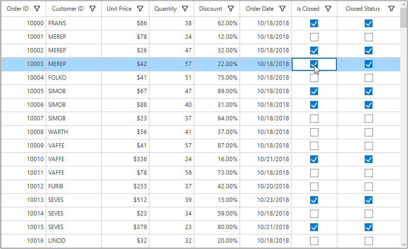

# How to Set Checkbox Value Based on the Value Change on Another Checkbox Column in WinForms DataGrid?

This example illustrates how to set CheckBox value based on the value change on another CheckBox column in [WinForms DataGrid](https://www.syncfusion.com/winforms-ui-controls/datagrid) (SfDataGrid).

You can set the value for a check box in one check box column when enabling or disabling it in another check box column using the [SfDataGrid.CellCheckBoxClick](https://help.syncfusion.com/cr/windowsforms/Syncfusion.WinForms.DataGrid.SfDataGrid.html#Syncfusion_WinForms_DataGrid_SfDataGrid_CellCheckBoxClick) and [SfDataGrid.CurrentCellActivating](https://help.syncfusion.com/cr/windowsforms/Syncfusion.WinForms.DataGrid.SfDataGrid.html#Syncfusion_WinForms_DataGrid_SfDataGrid_CurrentCellActivating) events.

#### C#

``` csharp
this.sfDataGrid1.CellCheckBoxClick += sfDataGrid1_CellCheckBoxClick;
this.sfDataGrid1.CurrentCellActivating += sfDataGrid1_CurrentCellActivating;
 
void sfDataGrid1_CurrentCellActivating(object sender, CurrentCellActivatingEventArgs e)
{
    if (e.DataColumn.GridColumn.MappingName == "ClosedStatus")
        e.Cancel = true;
}
 
void sfDataGrid1_CellCheckBoxClick(object sender, CellCheckBoxClickEventArgs e)
{
    if (e.Column.MappingName == "ClosedStatus")
        e.Cancel = true;
 
    if (e.Column.MappingName == "IsClosed")
    {
        (e.Record as OrderInfo).ClosedStatus = e.NewValue == CheckState.Checked;
    }
}
```

#### VB

``` vb
AddHandler Me.sfDataGrid1.CellCheckBoxClick, AddressOf sfDataGrid1_CellCheckBoxClick
AddHandler Me.sfDataGrid1.CurrentCellActivating, AddressOf sfDataGrid1_CurrentCellActivating
 
Private Sub sfDataGrid1_CurrentCellActivating(ByVal sender As Object, ByVal e As CurrentCellActivatingEventArgs)
    If e.DataColumn.GridColumn.MappingName = "ClosedStatus" Then
        e.Cancel = True
    End If
End Sub
 
Private Sub sfDataGrid1_CellCheckBoxClick(ByVal sender As Object, ByVal e As CellCheckBoxClickEventArgs)
    If e.Column.MappingName = "ClosedStatus" Then
        e.Cancel = True
    End If
 
    If e.Column.MappingName = "IsClosed" Then
        TryCast(e.Record, OrderInfo).ClosedStatus = e.NewValue = CheckState.Checked
    End If
End Sub
```

